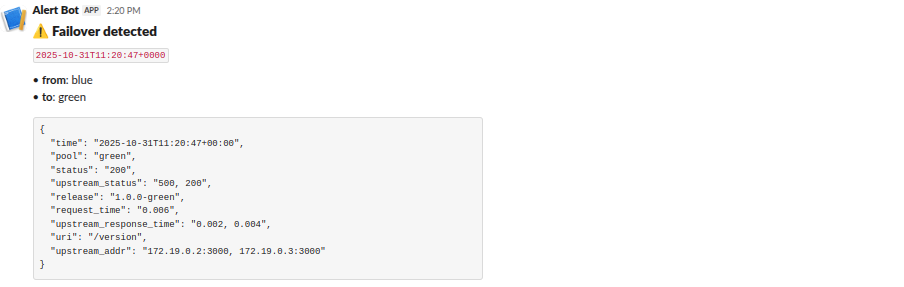

# 🧭 Blue/Green Deployment with Auto Failover & Slack Alerts

This project implements **automated Blue/Green deployment monitoring** using Nginx access logs and a Python watcher that detects:

- 🔄 **Failover events** (Blue → Green or Green → Blue)
- ⚠️ **High error rates** (e.g., >2% 5xx over the last 200 requests)
- 🚨 Sends alerts to **Slack** using an incoming webhook.

---

## ⚙️ Setup Instructions

### 1. Clone Repository

```bash
git clone https://github.com/<your-repo>.git
cd <your-repo>
```
### 2. Environment Configuration

Create a .env file in the project root (example already provided):

```bash
cp .env.example .env
```

Update the following values in .env:

- SLACK_WEBHOOK_URL → your actual Slack Incoming Webhook URL

Adjust thresholds if needed:

```bash
ERROR_RATE_THRESHOLD=2
WINDOW_SIZE=200
ALERT_COOLDOWN_SEC=300
```

### 3. Start the Full Stack
Bring up Nginx, the Blue/Green Node.js services, and the alert watcher:

``` bash
docker compose up -d
```

To view live logs:

```bash
docker compose logs -f
```

## 🔬 Chaos Testing (Simulate Failovers)

You can test the watcher’s alerting system by intentionally causing traffic failures.

### Trigger Failover
Access the Blue service and simulate it failing (e.g., stop the container):

```bash
docker stop <blue_container_name>
```

Nginx will route traffic to Green.

The watcher will detect this pool change and send:

“Failover detected! Traffic switched from BLUE → GREEN”

### Trigger High Error Rate

Run a quick loop of failing requests:

```bash
for i in {1..100}; do curl -s -o /dev/null -w "%{http_code}\n" http://localhost:8080/error || true; done
```

Once error percentage exceeds threshold, you’ll see:

“High upstream error rate detected: 5.50% over last 200 requests”

## 🧠 How to View Logs & Verify Slack Alerts
1. Watcher Container Logs

```bash
docker compose logs -f alert_watcher
```

You should see messages like:

```bash
[ALERT] Failover detected! Traffic switched from BLUE → GREEN
[INFO] Alert suppressed (cooldown active)
```

2. Nginx Access Logs
Check structured JSON logs:

```bash
docker compose exec nginx tail -f /var/log/nginx/access.log
```

Example log snippet:

```json
{
  "time": "2025-10-30T09:22:43+00:00",
  "pool": "blue",
  "release": "1.0.0-blue",
  "status": 502,
  "upstream_status": 502,
  "latency_ms": 45,
  "request": "GET /api/status HTTP/1.1"
}
```

## 💬 Slack Alerts Reference

### 🔄 Slack Alert – Failover Event

When traffic shifts between pools:

Failover detected! Traffic switched from BLUE → GREEN

📸 Screenshot Example:



### ⚠️ Slack Alert – High Error Rate

Triggered when >2% of recent requests return 5xx:

High upstream error rate detected: 5.00% over last 200 requests

📸 Screenshot Example:


### 📦 Container Logs

A snippet of the Nginx log line showing structured log fields (pool, release, upstream status, latency, etc.).

📸 Screenshot Example:


## 🧹 Maintenance Mode
To silence alerts during planned updates or toggles:

```bash
# Disable watcher alerts
echo "MAINTENANCE_MODE=true" >> .env
docker compose restart alert_watcher
```

To re-enable:

```bash
sed -i 's/MAINTENANCE_MODE=true/MAINTENANCE_MODE=false/' .env
docker compose restart alert_watcher
```

## 📂 Project Structure (Additions to HNG Stage 2 Project)

The following files and configurations were added to extend the existing Blue/Green deployment project with monitoring, alerting, and observability features.

```bash
├── docker-compose.yml
├── watcher.py
├── requirements.txt
├── .env
├── .env.example
├── runbook.md
└── README.md
```

## ✅ Verification Checklist

| Step                    | Expected Result                |
| ----------------------- | ------------------------------ |
| `docker compose up -d`  | All containers healthy         |
| Stop Blue container     | Failover alert in Slack        |
| Simulate 5xx errors     | High error-rate alert in Slack |
| Enable maintenance mode | No new alerts                  |
| Recover Blue            | Recovery noted in logs         |
