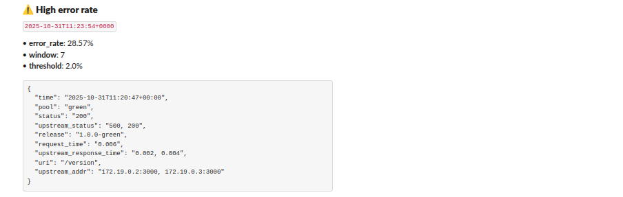
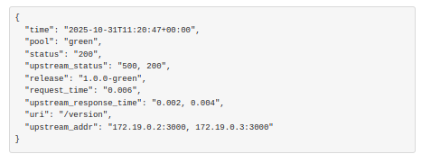

# Blue/Green Deployment Runbook
## 📘 Overview

This runbook documents how to operate, monitor, and troubleshoot the Blue/Green deployment with automatic failover and Slack alerts.

The system consists of:

- Nginx as the load balancer and traffic router.

- Blue and Green application containers (only one is live).

- Watcher service (watcher.py) for real-time monitoring and Slack alerts.
- Slack integration for instant notifications.

## 🚀 Deployment Workflow
1. Build and Start Services
```bash
docker-compose up -d --build
```

This command:

- Builds and launches Nginx, Blue, Green, and Watcher services.

- Loads environment variables from .env.

- Starts watching Nginx logs automatically.

## 🧩 Environment Variables

| Variable               | Description                                    | Example                                |
| ---------------------- | ---------------------------------------------- | -------------------------------------- |
| `BLUE_IMAGE`           | Docker image for Blue service                  | `yimikaade/wonderful:devops-stage-two` |
| `GREEN_IMAGE`          | Docker image for Green service                 | `yimikaade/wonderful:devops-stage-two` |
| `ACTIVE_POOL`          | Currently active pool receiving traffic        | `blue`                                 |
| `SLACK_WEBHOOK_URL`    | Slack webhook for posting alerts               | `https://hooks.slack.com/services/...` |
| `ERROR_RATE_THRESHOLD` | Max 5xx error rate (%) before triggering alert | `2`                                    |
| `WINDOW_SIZE`          | Number of recent requests to check             | `200`                                  |
| `ALERT_COOLDOWN_SEC`   | Minimum seconds between alerts                 | `300`                                  |
| `MAINTENANCE_MODE`     | If `true`, disables auto-failover              | `false`                                |

## 🧠 Monitoring & Alerts
1. Slack Notifications

Watcher posts to Slack when:

- ✅ Failover occurs (Blue → Green or vice versa)

-  ⚠️ Error rate threshold exceeded

- 💤 Cooldown active — duplicate alerts are suppressed

2. Manual Trigger Check

You can manually test Slack integration:

```bash 
docker exec -it alert_watcher python watcher.py --test-alert
```

## 🧰 Failover Procedure
### 🧭 Automatic Failover

If Watcher detects a sustained 5xx rate > threshold:

It switches traffic from ACTIVE_POOL → standby pool.

Posts a Slack alert:
“Auto-failover triggered: Blue → Green due to 5xx error spike.”

### 🔁 Manual Failover

If you need to switch pools manually:

```bash
export ACTIVE_POOL=green
docker-compose up -d nginx
```

Then confirm:

```bash
curl http://<server_ip>/version
```

## ⚠️ Recovery Steps
1. Blue or Green Crash

```bash
docker-compose restart blue


or

docker-compose restart green
```

2. Nginx Not Responding

Check logs:

```bash
docker logs nginx
```

Restart if needed:

```bash
docker-compose restart nginx
```

3. Watcher Not Sending Alerts

```bash
docker logs alert_watcher
```

If Slack is misconfigured:

- Recheck SLACK_WEBHOOK_URL in .env

- Restart watcher:

```bash
docker-compose restart alert_watcher
```

## 🧹 Maintenance Mode

- To prevent auto-failover during deployments:

```bash
export MAINTENANCE_MODE=true
docker-compose up -d alert_watcher
```

- Re-enable auto mode when done:

```bash
export MAINTENANCE_MODE=false
docker-compose up -d alert_watcher
```

## 🧾 Log Locations
| Service    | Log Path                                 | Description                  |
| ---------- | ---------------------------------------- | ---------------------------- |
| Nginx      | `/var/log/nginx/access.log`              | Request and error tracking   |
| Watcher    | `docker logs alert_watcher`              | Monitoring and alert history |
| Blue/Green | `docker logs blue` / `docker logs green` | Application logs             |

## 🧯 Incident Response Quick Guide
| Symptom                | Likely Cause                    | Resolution                                     |
| ---------------------- | ------------------------------- | ---------------------------------------------- |
| 🔴 No Slack alerts     | Invalid webhook / watcher crash | Verify `.env`, restart watcher                 |
| ⚠️ High 5xx errors     | App deployment issue            | Trigger manual failover, debug inactive pool   |
| 💤 Duplicate alerts    | Cooldown not elapsed            | Wait for `ALERT_COOLDOWN_SEC` or reset watcher |
| ⚙️ Failover stuck      | Wrong `ACTIVE_POOL`             | Manually export and redeploy nginx             |
| ❌ Both pools unhealthy | Deployment error                | Rollback previous known good image             |

## 📤 Verification

After deployment or failover, confirm:

```bash 
curl http://<server_ip>/version
```

Expected output:

```bash
{
  "active_pool": "green",
  "version": "v2.1.0"
}
```

## 🧩 Useful Commands

# Rebuild and restart watcher

```bash
docker-compose up -d --build alert_watcher
```

# View watcher logs live

```bash
docker logs -f alert_watcher
```

# Test Nginx access logs

```bash
tail -f /var/log/nginx/access.log
```

## 💬 Slack Alerts Reference

### 🔄 Slack Alert – Failover Event

When traffic shifts between pools:

Failover detected! Traffic switched from BLUE → GREEN
📸 Screenshot Example:


### ⚠️ Slack Alert – High Error Rate

Triggered when >2% of recent requests return 5xx:

High upstream error rate detected: 5.00% over last 200 requests

📸 Screenshot Example:



### 📦 Container Logs

A snippet of the Nginx log line showing structured log fields (pool, release, upstream status, latency, etc.).

📸 Screenshot Example:

